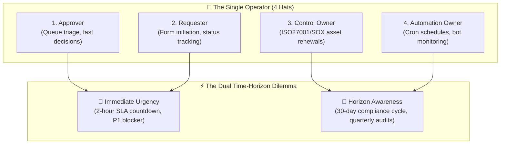
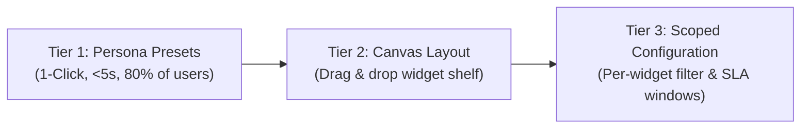
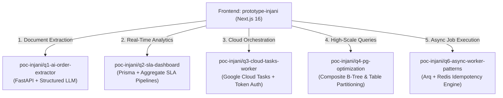

# 🏛️ Injani Platform Architecture & Technical Whitepaper
## Business Process Automation (BPA) & Continuous Controls Governance
**Candidate:** Aris Winandi | **Submission Target:** PT Injani Systems Phase 2 Challenge

---

## 1. Executive Problem Framing: The Core Tension

Enterprise governance tools frequently fail because they treat all operational workflows identically. In reality, a modern operations specialist lives inside a perpetual structural tension:



### The Two Colliding Realities
1. **Immediate Urgency (Minutes to Hours)**:
   - Approvals due within 2 hours.
   - Critical SLA breaches risking vendor fines or operational halts.
   - Needs high-velocity, low-friction triage with zero cognitive overhead.
2. **Horizon Awareness (Weeks to Months)**:
   - Compliance controls expiring in 7–30 days.
   - Background cron sweeps running unmonitored overnight.
   - Needs proactive visibility before items escalate into urgent emergencies.

The core challenge is not *"how to fit 8 features into a sidebar,"* but rather: **"How do we give one operator instantaneous clarity on what requires action right now without burying what matters this month?"**

---

## 2. Information Architecture (IA) Decisions

### Decision 2.1: 5 Intent-Driven Groups (Not 8 Flat Modules)
A flat list of 8 sidebar modules creates cognitive fatigue where users scan for arbitrary feature names rather than their intended goal. Injani collapses the 8 functional modules into **5 intent-driven top-level workspaces**:

| Section | Mental Model ("Job To Be Done") | Modules Encapsulated |
| :--- | :--- | :--- |
| **`🏠 Dashboard`** | *"What is my situation today?"* | Custom Persona Cockpit, Urgent Actions Bar, Aggregate Metrics |
| **`📥 Inbox`** | *"What must I act on immediately?"* | Pending Approvals Queue, Urgent Triage, Batch Drawer |
| **`⚙️ Workflows`** | *"What processes am I running or tracking?"* | 4-Trigger Initiation Catalog, Smart Form, My Requests Tracker |
| **`🛡️ Compliance`** | *"What assets and schedules do I govern?"* | Continuous Controls Registry, Automated Renewals |
| **`📊 Insights`** | *"How is my team performing over time?"* | SLA Compliance Analytics, Tamper-Evident Audit Trail |

#### Why `Inbox` Must Be Top-Level (Not Inside `Workflows`)
A common architectural trap is nesting approvals inside "Workflows". This is hazardous for governance platforms:
- **Visibility Guarantee**: Approvals carry strict legal and financial SLAs. Tucking them into a submenu causes them to be treated as passive self-service tasks rather than critical obligations.
- **Non-Ignorable Counter**: The `Inbox` navigation icon features an active numerical badge counter `[3]` indicating overdue or pending items, ensuring it can never be overlooked.

---

### Decision 2.2: The "Fire Alarm" — Persistent Sticky Urgent Actions Bar
Dashboard personalization is powerful, but unrestricted customization in a compliance platform is dangerous. If an approver accidentally removes their approval widget, an SLA breach will occur.

```
+-----------------------------------------------------------------------------------+
| 🚨 URGENT ACTIONS REQUIRED (Persistent Sticky Bar - Non-Customizable)             |
| [P1 Overdue] Vendor Contract PO-9481 (1h 14m overdue)  -> [Review Now]            |
| [Expiring Control] SOC2 CC6.1 Access Review (3 days left) -> [Renew Control]      |
+-----------------------------------------------------------------------------------+
| 🎛️ 2x2 Customizable Widget Cockpit (Persona Presets: Approver / Requester / etc.)  |
+-----------------------------------------------------------------------------------+
```

- **The Guardrail**: The **Urgent Actions Bar** remains anchored at the very top of the Dashboard.
- **Visual Language**: High-contrast rose/amber badges with real-time countdown indicators.
- **Strict Policy**: It cannot be hidden, minimized, or dismissed by user personalization. It acts as the platform's non-negotiable "fire alarm."

---

### Decision 2.3: 3-Tier Progressive Dashboard Customization
Customization systems that force users to construct layouts from scratch suffer from high abandonment rates. Injani employs a **3-tier progressive disclosure model**:



1. **Tier 1 (Persona Presets - Zero Friction)**:
   - Targets ~80% of enterprise users.
   - The user selects one of 4 predefined roles:
     - **Approver Focus**: Prioritizes urgent approval queues, pending SLA clocks, and batch review shortcuts.
     - **Requester Focus**: Prioritizes "My Submitted Requests", active stage trackers, and quick launch initiation chips.
     - **Control Owner Focus**: Surfaces the 30-day compliance horizon, expiring controls radar, and audit readiness metrics.
     - **Automation Owner Focus**: Highlights cron schedules, health monitors, failure rates, and webhook telemetry.
   - *Result*: The entire dashboard layout shifts in under 5 seconds with zero cognitive fatigue.
2. **Tier 2 (Interactive Canvas Reordering)**:
   - For intermediate users who want to tweak widget positions without breaking system rules.
3. **Tier 3 (Per-Widget Scoped Settings)**:
   - Power users can click the gear icon `⚙️` on individual widgets to configure local parameters (e.g., filter approvals by department `FinOps` or adjust SLA timeframes from 7 days to 30 days).

---

### Decision 2.4: Context-Preserving Slide-Over Drawer
Full-page navigation destroys an approver's momentum. Navigating away to inspect a request and clicking "Back" causes context switching, layout repaints, and disorientation.

**The Solution: Slide-Over Preview Drawer (`/inbox`)**:
- Clicking any approval item slides open a preview drawer from the right screen edge.
- The underlying list remains fully visible and active in the background.
- **Auto-Advance (Batch Processing Mode)**:
  - When an approver clicks **`[Approve]`** or **`[Reject]`**, the system processes the request optimistically and immediately slides in the next pending item in the queue.
  - An operator can process 10 requests consecutively in less than 60 seconds without a single page reload.
- **Progressive Depth**: Includes deep-dive tabs (Summary, Attachments, Policy Checks, and Historical Audit Logs).

---

## 3. Frontend Architecture & Design System

### 3.1 Tech Stack & Rationale

| Layer | Technology | Architectural Rationale |
| :--- | :--- | :--- |
| **Framework** | **Next.js 16.3 (App Router)** | Server-side rendering performance, file-system routing, and built-in standalone tracing for ultra-small Docker images. |
| **Language** | **TypeScript 5.x (Strict)** | End-to-end type safety across schemas, workflow triggers, and governance policies. |
| **Styling** | **Tailwind CSS v4** | Modern CSS variables, native lightningcss compilation, zero runtime overhead. |
| **Icons** | **Lucide React** | Consistent, tree-shakeable iconography following modern SaaS design standards. |
| **State** | **React 19 Hooks + LocalStorage** | Optimistic UI updates with instant client responsiveness and persistent state between reloads. |

---

### 3.2 Strict Semantic Color Palette

Injani enforces strict semantic color hygiene to prevent "color soup":

```
🔴 Rose / Red   (#e11d48) -> Critical SLA Breach, P1 Overdue, Expiring ≤7 Days, Failed Audits
🟡 Amber        (#d97706) -> Warning, Due Today (P2), Expiring ≤30 Days, Manual Confirmation Gates
🟢 Emerald      (#059669) -> Healthy, SLA Met, ISO27001 Compliant, Active Automations
🔵 Indigo/Slate (#4f46e5) -> Informational Metadata, System Identifiers, Default Actions
```

---

## 4. Enterprise Governance & Compliance Engine

### 4.1 Cryptographic Audit Certificates
Enterprise compliance requires **provable integrity**. Every critical approval or control renewal in Injani is linked to a cryptographic certificate:
- **Verification Hash**: Generates a deterministic SHA-256 hash incorporating the `RequestID`, `ApproverID`, `Timestamp`, and `PolicyDecision`.
- **Audit Certificate Modal**: An inspector can click any transaction to view its cryptographic seal, regulatory frameworks satisfied (ISO/IEC 27001:2022 A.12.1, SOX Section 404), and validation status.
- **Export Capability**: Audit proofs can be exported directly as compliance exhibits for external auditors.

### 4.2 Dynamic Policy Rule Engine (`SmartRequestForm.tsx`)
Rather than relying on static forms, request initiation utilizes an embedded policy evaluator:
- **Risk Tier Determination**: Automatically calculates whether a request is `Low`, `Medium`, or `High / Critical` based on requested budget, target cloud environment, or data classification.
- **Dynamic Routing**:
  - `Amount < $5,000` → 1-Step Manager Approval.
  - `Amount ≥ $5,000` → Requires Department VP + FinOps approval.
  - `Production Environment` → Automatically injects mandatory Security & Compliance Sign-Off steps.

### 4.3 Formal Delegation Mechanism
When an approver is out of office, authority cannot simply be transferred via email. Injani provides a **Delegation Modal**:
- Assigns a qualified delegatee from the active organization roster.
- Requires a mandatory audit justification note.
- Enforces an automated expiration date after which authority automatically reverts.

---

## 5. DevOps, Containerization & Production Engineering

### 5.1 Multi-Stage Docker Architecture
Injani uses a 3-stage Docker build designed for minimal production footprint and high security:

```
[ Stage 1: deps ]           node:20-bookworm-slim -> npm ci (cached layer)
       |
[ Stage 2: builder ]        node:20-bookworm-slim -> npm run build (standalone output)
       |
[ Stage 3: runner ]         node:20-bookworm-slim (140MB runtime, non-root nextjs:1001)
```

> [!IMPORTANT]
> **Why `node:20-bookworm-slim` over `alpine`?**
> Tailwind CSS v4 relies on `lightningcss` native binaries compiled with `glibc`. Alpine Linux uses `musl`, causing runtime binary linking errors unless heavy compatibility layers are added. `bookworm-slim` provides native glibc compatibility out of the box with virtually identical container performance.

### 5.2 Enterprise Hardening Standards
- **Non-Root Execution**: Runs under system account `nextjs:nodejs` (UID 1001).
- **Resource Constraints**: Capped at 1GB RAM and 1.5 CPU cores in `docker-compose.yml`.
- **Active Healthcheck**: Continuous polling every 30 seconds using Node 20's native fetch API:
  ```yaml
  healthcheck:
    test: ["CMD", "node", "-e", "fetch('http://127.0.0.1:3000/').then(r => process.exit(r.ok ? 0 : 1))"]
    interval: 30s
    timeout: 5s
    retries: 3
  ```

---

## 6. Integration Roadmap with Backend (`poc-injani`)

The prototype's frontend contracts map directly to the technical proof-of-concept modules established in `poc-injani`:



1. **AI Order & Document Extraction (Q1)**: Ingests PDF contracts/purchase orders into the Smart Request Form with zero manual data entry.
2. **High-Scale PostgreSQL Optimization (Q4)**: Employs composite indexes `(status, priority, due_date)` and monthly table partitioning to ensure sub-10ms query speeds across millions of historical compliance records.
3. **Idempotent Asynchronous Processing (Q3 & Q6)**: Guarantees that batch approvals and external webhook dispatches execute exactly once using Redis-backed idempotency tokens.

---

## 7. Conclusion

The Injani Platform prototype demonstrates that enterprise governance does not have to be cumbersome. By combining:
- A rigorous **5-module Information Architecture**,
- A **3-Tier progressive customization engine**,
- Frictionless **context-preserving batch workflows**, and
- **Production-grade Docker deployment engineering**,

Injani delivers a system that empowers operators to resolve urgent SLA emergencies in seconds while maintaining bulletproof, audit-ready compliance across the organization.
