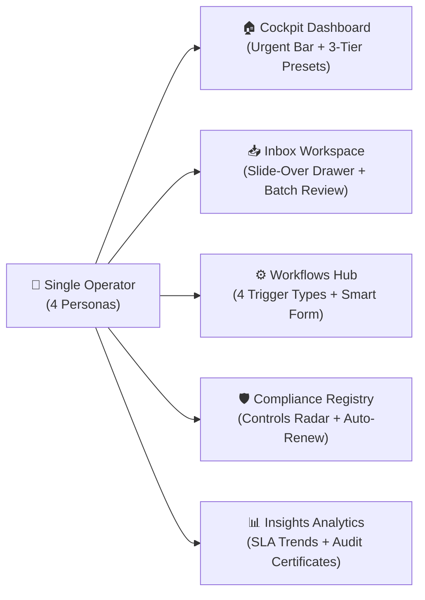

# 🛡️ Injani BPA & Continuous Controls Platform

[](https://nextjs.org/)
[](https://www.typescriptlang.org/)
[](https://tailwindcss.com/)
[](https://www.docker.com/)
[](./ARCHITECTURE.md#enterprise-governance)
[](#)

> **Injani Platform** is an enterprise-grade web application unifying **Business Process Automation (BPA)** with **Continuous Controls Governance**. Engineered to resolve the core tension of a single operator simultaneously managing immediate operational SLAs (2-hour urgency) and long-term regulatory compliance (30-day audit horizons).

---

## 🧭 Executive Summary: The Core Design Tension

In high-velocity enterprise environments, operational teams face a daily dilemma:
1. **The Multi-Hat Operator**: A single professional frequently acts as an **Approver** (clearing ticket queues), a **Requester** (initiating and tracking requests), a **Control Owner** (certifying ISO27001/SOX controls), and an **Automation Owner** (monitoring scheduled jobs and webhooks).
2. **Dual Time Horizons**:
   - **Immediate Urgency**: Approvals due in 2 hours, pending triage, SLA breach threats.
   - **Horizon Awareness**: Compliance controls expiring in 7–30 days, recurring cron automation health.

**Injani resolves this** not by cramming features into a bloated menu, but through a **5-Module Intent-Driven Information Architecture**, a **3-Tier Progressive Dashboard**, a **Context-Preserving Slide-Over Batch Drawer**, and **Cryptographic Audit Certificates**.

---

## 🌟 Key Features & Capabilities



### 1. 🏠 Dynamic Dashboard Cockpit
- **Non-Removable Urgent Actions Bar**: Persistent top-level "fire alarm" displaying live SLA breach countdowns and overdue items. Cannot be hidden by personalization.
- **3-Tier Progressive Customization**:
  - **Tier 1 (Casual - ~80%)**: 1-click **Persona Presets** (*Approver*, *Requester*, *Control Owner*, *Automation Owner*) instantly reconfiguring the 2x2 widget layout in under 5 seconds.
  - **Tier 2 (Intermediate)**: Canvas-level widget rearrangement.
  - **Tier 3 (Power Users)**: Scoped widget configurations (department filtering, custom SLA reporting timeframes).
- **Time Horizon Visual Balance**: High-contrast urgency alerts (Red/Amber) alongside long-term compliance health radars (Emerald).

### 2. 📥 Triage Inbox & Slide-Over Drawer
- **Priority Tiering**: Instant visual segregation into `OVERDUE (P1)`, `DUE TODAY (P2)`, and `UPCOMING (P3)`.
- **Context-Preserving Slide-Over Drawer**:
  - Evaluates requests in an overlay drawer from the right without losing list position or navigating away.
  - **Auto-Advance (Batch Processing)**: Approving or rejecting an item automatically transitions the drawer to the next queued item.
  - Interactive actions: **Approve**, **Reject**, **Delegate** (with audit trail notes), and **Request Info**.

### 3. ⚙️ Workflows & 4-Trigger Initiation Catalog
- **Multi-Modal Initiation Catalog**:
  - **Manual Trigger**: Standard operational forms with step-by-step SLA indicators.
  - **Scheduled (Cron)**: Data-dense schedule matrix with direct **`▶ Run Now`** execution triggers.
  - **Webhook Trigger**: Event-driven ingress endpoints with secret tokens and payload schemas.
  - **One-Time Trigger**: Guardrailed execution with confirmation gates for irreversible operations.
- **Smart Request Initiation Form**:
  - Embedded **Dynamic Policy Engine**: Automatically evaluates expenditure thresholds, risk levels (P1/P2/P3), and dynamically computes the required approval chain before submission.
- **My Requests Tracker**: Real-time status cards, stage-by-stage progression bars, and SLA countdowns.

### 4. 🛡️ Continuous Controls Governance
- **Controls Registry**: Color-coded expiration radar (🔴 ≤7d, 🟡 ≤30d, 🟢 Healthy >30d).
- **Automated Renewal**: 1-click **`[Start Renewal Workflow →]`** bridging compliance assets directly into active workflow approvals.

### 5. ⚡ Enterprise UX Utilities
- **Command Palette (`Ctrl+K` / `⌘K`)**: Omnipresent keyboard launcher for global navigation, instant persona switching, and rapid action execution.
- **Cryptographic Audit Certificate Modal**: Generates exportable, tamper-evident audit proofs with **SHA-256 verification hashes**, ISO27001/SOX metadata, and auditor validation badges.
- **Integrated Notification Center**: Real-time alerts dropdown with unread filtering, sound indicators, and priority grouping.
- **Formal Delegation Modal**: Delegate approval authority to peers with mandatory audit reasons and expiration dates.

---

## 🚀 Quick Start Guide

### Option 1: Local Development

**Prerequisites**: Node.js 20+ and npm.

```bash
# Navigate to the prototype directory
cd prototype-injani

# Install dependencies
npm ci

# Start the Next.js development server
npm run dev
```

Open **[http://localhost:3000](http://localhost:3000)** in your browser.

---

### Option 2: Production Docker Container (Recommended)

The application includes an enterprise-hardened multi-stage Docker build (`node:20-bookworm-slim`) leveraging Next.js standalone output:

```bash
# Navigate to the prototype directory
cd prototype-injani

# Build and start the container in background
docker compose up -d --build
```

- **Container Status**: Built-in healthcheck validates the container every 30 seconds.
- **Mapped URL**: Open **[http://localhost:3005](http://localhost:3005)** *(Port 3005 avoids host conflicts)*.
- **To view live logs**: `docker compose logs -f`
- **To stop the container**: `docker compose down`

---

## ⌨️ Keyboard Shortcuts

| Shortcut | Action | Scope |
| :--- | :--- | :--- |
| `Ctrl + K` / `⌘ + K` | Open Command Palette | Global |
| `Esc` | Close Drawer / Modal / Palette | Global |
| `G` then `D` | Go to Dashboard | Command Palette |
| `G` then `I` | Go to Inbox | Command Palette |
| `G` then `W` | Go to Workflows | Command Palette |
| `G` then `C` | Go to Compliance Controls | Command Palette |
| `G` then `A` | Go to Insights & Analytics | Command Palette |

---

## 📂 Project Directory Structure

```text
prototype-injani/
├── src/
│   ├── app/                    # Next.js 16 App Router
│   │   ├── layout.tsx          # Root HTML layout with Geist font
│   │   ├── page.tsx            # Dashboard Cockpit with Persona Switcher
│   │   ├── inbox/              # Triage Inbox & Slide-Over Drawer
│   │   ├── workflows/          # 4-Trigger Catalog & Request Tracker
│   │   ├── compliance/         # Controls Registry & Expirations
│   │   └── insights/           # SLA Analytics & Audit Trail
│   ├── components/             # Reusable Atomic & Feature Components
│   │   ├── layout/             # AppShell, Sidebar, Header, NotificationCenter
│   │   ├── forms/              # SmartRequestForm with Dynamic Policy Engine
│   │   ├── modals/             # CommandPalette, AuditCertificateModal, DelegationModal
│   │   └── workflows/          # RequestTracker, CatalogTabs
│   ├── data/                   # Mock Schemas, Approvals, Controls, Workflows
│   ├── hooks/                  # Custom Hooks (useLocalStorage, Keyboard events)
│   └── lib/                    # Utility functions (cn, formatters)
├── public/                     # Static assets & SVG icons
├── Dockerfile                  # Multi-stage production build (bookworm-slim)
├── docker-compose.yml          # Container orchestration with healthcheck
├── DEPLOYMENT.md               # Complete VPS + Caddy/Nginx SSL Deployment Guide
├── ARCHITECTURE.md             # In-depth UX Architecture & Technical Whitepaper
└── next.config.ts              # Next.js config with standalone output enabled
```

---

## 📚 In-Depth Documentation Links

- 🏛️ **[Detailed Architecture & UX Whitepaper (ARCHITECTURE.md)](./ARCHITECTURE.md)**: Comprehensive breakdown of information architecture, persona ergonomics, cryptographic verification, and design decisions.
- 🌐 **[Production VPS & Docker Deployment Guide (DEPLOYMENT.md)](./DEPLOYMENT.md)**: Step-by-step instructions for deploying to an Ubuntu VPS with Caddy / Nginx reverse proxy and automated Let's Encrypt SSL.
- ⚙️ **[Backend POC Modules (`poc-injani`)](../poc-injani/README.md)**: Proof-of-concept backend services including AI Order Extractor, Cloud Tasks workers, and PostgreSQL query optimization.

---

## 👤 Author & Submission Context

- **Author**: Aris Winandi
- **Submission Target**: PT Injani Systems — Phase 2 UI/UX & Engineering Challenge
- **Role Track**: Programmer (Next.js & Python)
